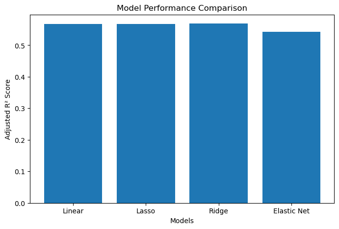
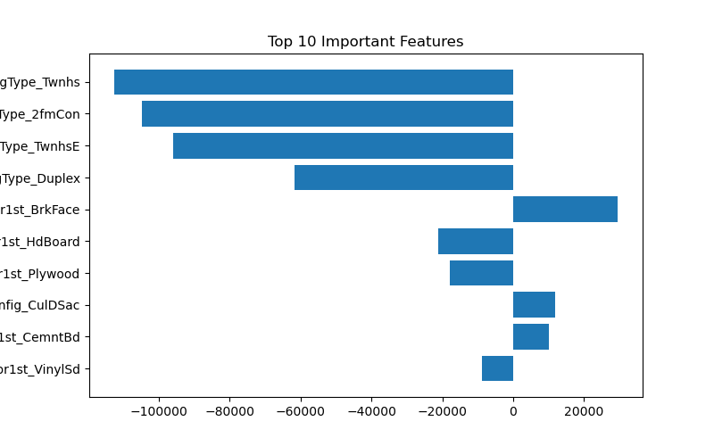

#  House Price Prediction

##  Overview
This project predicts house prices using Linear and Lasso Regression models.

##  Models Used
- Linear Regression  
- Lasso Regression (with LassoCV for automatic alpha selection)
- Ridge regression
- Elastic Net regression

##  Key Insights
- Linear and Lasso performed similarly (~0.5676 Adjusted R²)  
- Ridge showed slight improvement (~0.5689)  
- Elastic Net performed worse (~0.5423), indicating underfitting  
- Lasso removed 11 out of 34 features without affecting performance

###  Model Performance Comparison
This graph compares Adjusted R² scores of all models.

---

## Feature Importance (Lasso)
This graph shows the most important features selected by Lasso Regression.

##  Conclusion
All models performed similarly, indicating the dataset is well-structured.  
Simpler models were sufficient, while complex regularization did not significantly improve performance.

